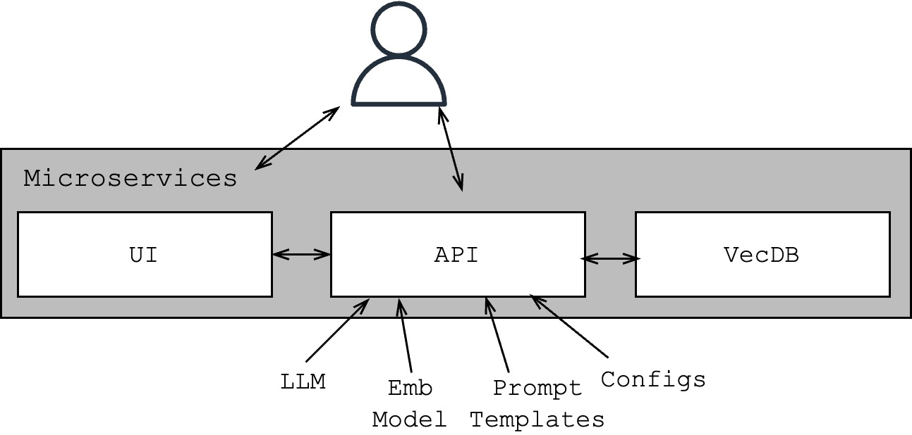
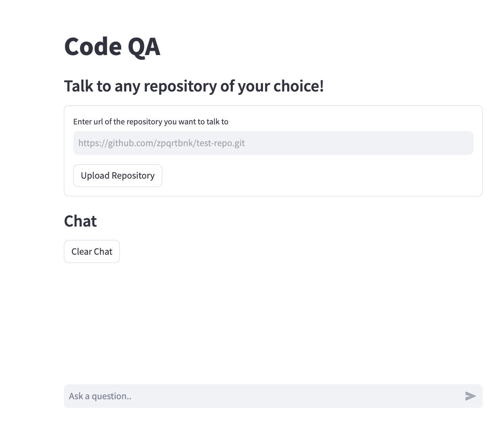

## CodeQA
Problem Statement:  
Given a URL of a Github repository, the proposed solution enables the user to have a priliminary understanding of the repository by asking the system in a conversation style setup.

### High Level Design:
 
3 main modules, each of which function as a standlone dockerized microservice:
- API: That captures the main tasks of downloading the repository, processing it, embedding the same and so on. More details can be found [here](/api/README.md)
- UI: Simple interface to see the solution in action.
- VecDB: A vector database that supports CRUD of vector embeddings as well as some metadata information.

### Demo:
See demo [here](https://drive.google.com/file/d/1T998EXyMlSp5AAx7G5ot6vAOE6gsYsar/view?usp=sharing)

### QuickStart:
- Include a `.env` file with a key for `OPENAI_API_KEY=""` in the `API` module (ie in [this](/api/) path)
- Download the embedding model from [here](https://drive.google.com/drive/folders/1LjC2qsG69-PWuv8No8l4vtVGi11bTfRN?usp=sharing) and place it in [this](/api/models/) location
- The microservices are encapsulated as composable docker services. Hence run   `docker-compose up ---build`   at the [root](/) location.
- You can find each of the modules in the following URLs:
    - UI: [localhost:8000](http://localhost:8000)
    - API: [localhost:8001/docs](http://localhost:8001/docs)
    - Qdrant Dashboard: [localhost:6333/dashboard](http://localhost:6333/dashboard)

### More technical details:
- UI: [Streamlit](https://streamlit.io/) is used for building a basic interactive app.
Screenshot:  
 
- API: [Fast API](https://fastapi.tiangolo.com/) is used for implementing RESTful services. More details about the supported APIs can be found [here](/api/).
- VectorDB: Self-hosted [Qdrant](https://qdrant.tech/) database is used as a vector database.

### Next steps:
- Improvements can be done at several places, Some of them (but not limited to) could be:
    - Filtering strategies while downloading the repo
    - Detecting programming language of the scripts and performing appropriate cleaning strategies
    - Creating richer metadata for the scripts at both document and chunk level such as summaries of functions, comments, function names etc.
    - More advanced strategies while embedding the scripts, to bring about "Contextual RAG".
- I have tried to add comments (`@TODO`) in appropriate places in the scripts.

